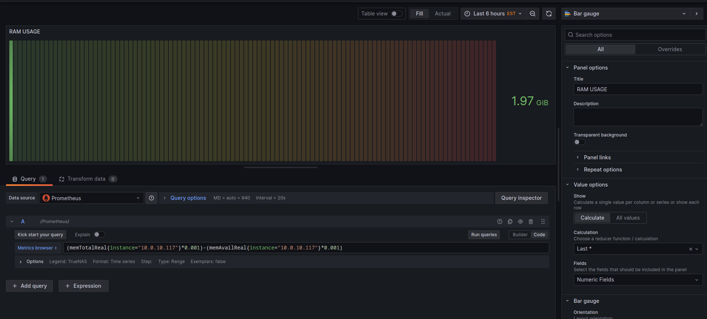
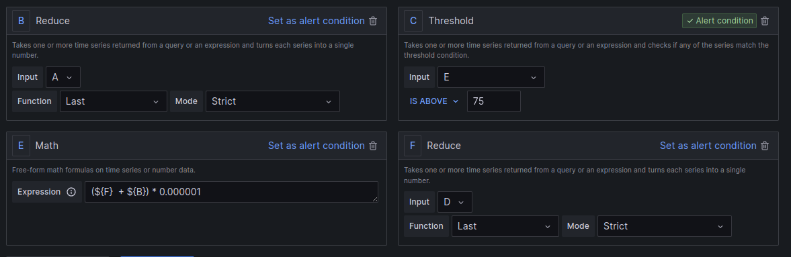

# supervision-final


## Introduction

Cette documentation a pour but de vous montrer et d'expliquer le fonctionnement d'une situation possible où l'on souhaite mettre en place une automatisation de création de tickets dans un serveur GLPI selon des conditions précises. Ces tickets seront créés à l'aide de mesures précises qui seront extraites de notre service TrueNAS.

J'ai choisi comme mesure l'utilisation de la bande passante en temps réel, c'est-à-dire le total des données entrantes et sortantes. Ensuite, j'ai pris la quantité totale de RAM de notre serveur TrueNAS.

Voici une vue d'ensemble du fonctionnement de mon infrastructure. Notez que les différentes sections de cette documentation iront plus en profondeur pour expliquer chaque service et leur but.


## Métrique sur Prometheus


Pour la métrique collectée avec Prometheus, il n'est malheureusement pas possible de récupérer la valeur directement de TrueNAS vers Prometheus. La solution que j'ai choisie est un service Snmp_exporter. Il joue un rôle d'intermédiaire entre TrueNAS et Prometheus. Il collecte les informations via SNMP que le serveur TrueNAS envoie et traduit les valeurs spécifiques souhaitées pour que Prometheus puisse les traiter. Pour plus d'informations sur Snmp_exporter, visitez: https://github.com/prometheus/snmp_exporter.


Voici comment le Snmp_exporter est configuré:

```
# Information d'authentification Snmpv2
auths:
  public_v2:
    community: public
    version: 2

modules:
  stockage:
    # liste des OIDs spécifiques que nous voulons envoyer au serveur Prometheus
    walk:
      - 1.3.6.1.4.1.2021.4.5
      - 1.3.6.1.4.1.2021.4.6
      - 1.3.6.1.4.1.50536.1.2.1.1.4
      - 1.3.6.1.4.1.50536.1.2.1.1.5
      - 1.3.6.1.4.1.2021.11.9
      - 1.3.6.1.4.1.2021.11.10
      - 1.3.6.1.4.1.2021.11.11
    metrics:
    - name: memTotalReal
      oid: 1.3.6.1.4.1.2021.4.5
      type: gauge
      help: la quantité de mémoire physique total de la machine
    - name: memAvailReal
      oid: 1.3.6.1.4.1.2021.4.6
      help: la quantité de memoir physique présentement utiliser
      type: gauge
```

Pour executer Snmp_exporter sur forme de service, vous devez créer un fichier de service systemd. Voici le mien pour une exemple:

```
[Unit]
Description=snmp_exporter
Wants=network-online.target
After=network-online.target

[Service]
User=root
Group=root
Type=simple
ExecStart=/usr/local/bin/snmp_exporter \
    --config.file=/etc/snmp_exporter/truenas.yml # specifie l'emplacement du fichier de configuration

[Install]
WantedBy=multi-user.target
```

Pour que Prometheus reçoivent bien les valeurs, nous devons ajouter cette job dans son fichier de config:

```
  - job_name: snmp
    metrics_path: /snmp
    params:
      module: [stockage]
    static_configs:
      - targets:
        - 10.0.10.117 # adresse du serveur TrueNas
    relabel_configs:
      - source_labels: [__address__]
        target_label: __param_target
      - source_labels: [__param_target]
        target_label: instance
      - target_label: __address__
        replacement: 10.0.10.129:9116 # adresse du serveur snmp_exporter

```

## Métrique sur Zabbix

Pour récupérer votre metric par Zabbix, vous devez mettre en place la recuperation de donner par snmp.

1. Dans la section 'Data collection', cliquer sur host

    

2. Cliquer sur 'create host'

    

3. Ajouter un nom

    

4. Choisissez le template TrueNAS

    

5. Ajouter un interface snmp selon les informations suivant:    
    ```
        Version: SNMPV2
        comuniter: public
    ```

    


Pour que vous puissiez envoyer vos donner sur le service Grafana, vous devez installer le plugins
de Zabbix sur Grafana.

```
grafana-cli plugins install alexanderzobnin-zabbix-app
```

Vous serrez en mesure maintenant d'ajouter une source de donner Zabbix et specifier l'adresse Ip de votre serveur Zabbix et les informations de connection.


## Mise en place d'un tableau de bord Grafana 

1. Pour créer un tableau de bord dans Grafana, vous devez vous rendre dans la section Dashboard.
2. Quand vous avez un nouveau tableau de bord, vous pouvez ajouter un panneau.



3. Pour ajouter vos métrique, la section query est la que vous specifier la source de la métrique et meme executer des calcules pour avoir une valeur personnaliser.


4. Dans le menu du panneau, c'est la que vous aurez la possibilité de personnaliser le look de votre panneau a votre guise.

## Configuration des seuil Grafana

Pour declarer un seuil dans Grafana, vous devez vous rendre dans la section Alerts>Alerts rules.


Vous devez lui donner un nom et specifier ou il peut trouver la métrique pour être utiliser pour votre seuil.


Vous devez spécifier les conditions de votre seuil dans la section suivante. Par exemple, vous pouvez voir que mes deux métriques (bits envoyés et bits reçus) dans la section B et F. Je veux qu'il prenne seulement la dernière valeur reçue pour ces deux métriques. Ensuite, dans la section E, je souhaite avoir la somme des deux et la convertir en Mo. Pour finir, la section C est celle où l'on spécifie notre seuil. Je souhaite que mon seuil soit déclenché lorsque la valeur est au-dessus de 75 Mo.



Dans la section annotations, vous devez specifier le nom et la description du ticket qui serras utiliser plus tard lors de l'envoie vers le Webhook 


Meme chose pour la section labels, tous les informations seront utile pour la creation de tickets.


## Automatisation GLPI

Pour l'automatisation de la création de tickets dans GLPI, j'ai opté pour la solution à l'aide d'un service webhook et d'un script Python. Comme expliqué dans la section précédente, mes seuils pour mes 2 métriques sont configurés dans Grafana. Quand ceux-ci sont atteints ou dépassés, Grafana envoie une requête à mon serveur avec un service webhook en cours d'exécution. Cette requête contient les informations pour créer un ticket telles que le titre, la description, etc. Ces informations sont extraites de la requête et sont passées à un script Python qui envoie une requête de création de tickets vers le serveur GLPI à l'aide de son API REST. Les sous-sections suivantes iront plus en profondeur sur la mise en place et le fonctionnement de la chaîne d'exécution.


### Alerte Grafana

1. Pour qu'une alerte déclenche quelque chose dans Grafana, il faut créer des 'Contact Point'.

    

2. Celui qui nous intéresse, c'est Webhook. Pour créer un point de contact WebHook, cliquer sur add Contact Point et Ajouter l'url vers votre serveur WebHook.

    

3. Ensuite, nous devons rajouter un règle de notification.

    

4. Il est important de specifier que notre point de contact est la règle de notification par défaut pour que tous les règles que nous avons créer auparavant soit router vers celui-ci

    


### Service WebHook

Pour mon WebHook, j'utilise [webhook](https://github.com/adnanh/webhook), tres simple d'utilisation et écrit en Go.

Webhook utilise des fichiers de configuration appeler Hook. Nous pouvons specifier comment nous voulons que notre service soit executer. Voici mon fichier Hook que j'ai utiliser:

```
# le nom du hook, a specifier dans le url du Grafana, par exemple, https://<adress ip>/hook/<Le ID>
- id: glpi
  
  # le script qu'on souhaite executer quand une requêtes est reçu  
  execute-command: /etc/webhook/scripts/glpi.sh
  
  # le chemin ou l’exécuteur se retrouvera lors de l'execution
  command-working-directory: /etc/webhook/scripts

  # simple message de réponse pour confirmer que le serveur a recu le message
  response-message: Execution du script glpi

  # le type de data de notre payload
  incoming-payload-content-type: application/json

  # les arguments qu'on veut extraire du payload
  pass-arguments-to-command:
    # Titre
    - source: payload
      name: alerts.0.annotations.summary

    # description
    - source: payload
      name: alerts.0.annotations.description

    # TTO
    - source: payload
      name: alerts.0.labels.TTO
    # TTR
    - source: payload
      name: alerts.0.labels.TTR

    # Niveau d'urgence
    - source: payload
      name: alerts.0.labels.urgency
```

Pour l'extraction du payload, vous devez prendre en compte comment que [Grafana](https://grafana.com/docs/grafana/latest/alerting/alerting-rules/manage-contact-points/webhook-notifier/) forme les payloads: 

```
  ...
  "alerts": [
    {
      "status": "firing",
      "labels": {
        "alertname": "High memory usage",
        "team": "blue",
        "zone": "us-1"
      },
      "annotations": {
        "description": "The system has high memory usage",
        "runbook_url": "https://myrunbook.com/runbook/1234",
        "summary": "This alert was triggered for zone us-1"
      },
      "startsAt": "2021-10-12T09:51:03.157076+02:00",
      "endsAt": "0001-01-01T00:00:00Z",
      "generatorURL": "https://play.grafana.org/alerting/1afz29v7z/edit",
      "fingerprint": "c6eadffa33fcdf37",
      "silenceURL": "https://play.grafana.org/alerting/silence/new?alertmanager=grafana&matchers=alertname%3DT2%2Cteam%3Dblue%2Czone%3Dus-1",
      "dashboardURL": "",
      "panelURL": "",
      "values": {
        "B": 44.23943737541908,
        "C": 1
      }
    },
    {
      "status": "firing",
      "labels": {
        "alertname": "High CPU usage",
        "team": "blue",
        "zone": "eu-1"
      },
      "annotations": {
        "description": "The system has high CPU usage",
        "runbook_url": "https://myrunbook.com/runbook/1234",
        "summary": "This alert was triggered for zone eu-1"
      },
      "startsAt": "2021-10-12T09:56:03.157076+02:00",
      "endsAt": "0001-01-01T00:00:00Z",
      "generatorURL": "https://play.grafana.org/alerting/d1rdpdv7k/edit",
      "fingerprint": "bc97ff14869b13e3",
      "silenceURL": "https://play.grafana.org/alerting/silence/new?alertmanager=grafana&matchers=alertname%3DT1%2Cteam%3Dblue%2Czone%3Deu-1",
      "dashboardURL": "",
      "panelURL": "",
      "values": {
        "B": 44.23943737541908,
        "C": 1
      }
    }
  ],

  ...

```

Pour spécifier la valeur que l'on souhaite extraire dans notre webhook, nous devons spécifier toutes les valeurs parentes de notre valeur dans le format suivant :

```
name:   parent.child.child
```

Vous voyez que la section "alerts" est une liste de hachages.
Webhook formate les listes en ajoutant un chiffre pour spécifier laquelle nous voulons. Vu qu'il y en aura toujours juste une dans notre situation, nous spécifions le chiffre 0.

```
# Titre
    - source: payload
      name: alerts.0.annotations.summary
```

Les valeurs extraites seront envoyées au script glpi.sh dans l'ordre de leur déclaration. Par exemple, prenez ces valeurs extraites d'un payload :

```
    "Le titre d'un ticket" "Sa description" 60 30 4
```
Ceux-ci sont alors facilement traitables pour être envoyés au script Python par le script glpi.sh :

```
#!/bin/bash

python create_ticket.py --title "$1" --desc "$2" --tto "$3" --ttr "$4" --urgency "$5"

```

Si vous voulez l'exécuter comme un service, vous devez créer une déclaration de service systemd. Par exemple, voici la mienne:

```
[Unit]
Description=snmp_exporter
Wants=network-online.target
After=network-online.target

[Service]
User=root
Group=root
Type=simple
ExecStart=/usr/local/bin/webhook \
	-hooks /etc/webhook/hook.yaml \
	-ip 10.0.10.129 \
	-cert /etc/webhook/ssl/webhook.cert \
	-key /etc/webhook/ssl/webhook.key \
	-secure \
	-debug \
	-verbose
[Install]
WantedBy=multi-user.target
```

### Script GLPI

Le script est relativement simple ; il utilise le module requests de Python pour interagir avec l'API REST de GLPI. Celui-ci s'exécute à l'aide d'un fichier de configuration suivant :

```
[GENERAL]
env = < development | production >

[PRODUCTION]
category_id = 1
category_name = stockage
equip_id = 16
exec_userid = 116
exec_name = stockageBot
group_id = 10
group_name = stockage
user_token = <user token>
api_token = <api token>
host = <url>

[DEVELOPMENT]
category_id = 1
category_name = stockage
equip_id = 2
exec_userid = 8
group_id = 1
group_name = stockage
exec_name = stockageBot
user_token = <user token>
api_token = <api token>
host = <url>

```

Dans la section "general", la valeur "env" spécifie lequel des deux environnements que le script va utiliser. J'ai conçu les désignateurs de la sorte, car cela me permet de passer très rapidement entre une période de tests sur un GLPI local et de le mettre en mode production sur le vrai GLPI. Ce fichier contient les informations qui peuvent être réutilisées entre les différentes exécutions.

La documentation sur l'API de GLPI se trouve ici.

Le script [create_ticket](./script/create_ticket.py) se trouve dans le dossier "script". Vous pourrez y voir son fonctionnement accompagné de plus de documentation.


## Mise en place des scenarios de teste

Pour tester une utilisation de la RAM qui va déclencher l'alerte que le seuil d'utilisation de la RAM a été dépassé, j'utiliserais la commande suivante.

```
head -c 7000m /dev/zero | tail
```

Le fichier /dev/zero retourne autant de caractères null ASCII qu'il en est demandé. Je lui en demande pour 7 Go. Vu que la sortie de la commande est envoyée à la commande tail, celle-ci doit le garder en mémoire. Donc, j'ajoute 7 Go de caractères nuls ASCII en mémoire.

Pour tester l'usage excessif de la bande passante, j'utilise la commande suivante sur une machine distante du serveur TrueNAS

```
iperf -c 10.0.10.117 -u -t 300 -b 100M

ou
  '-c' Spécifie le mode client avec l’adresse de la machine client.
  '-u' Utilise le protocole UDP au lieu de TCP.
  '-t' Le temps en seconde pour écouter pour une nouvelle connexion.
  '-b' La grosseur de la bande passante a envoyer (100 mib pour moi). 

```

Cette commande me permet de tester un niveau de traffics tres élever si par exemple ma carte de reseau permets le traffics de 100mb.


